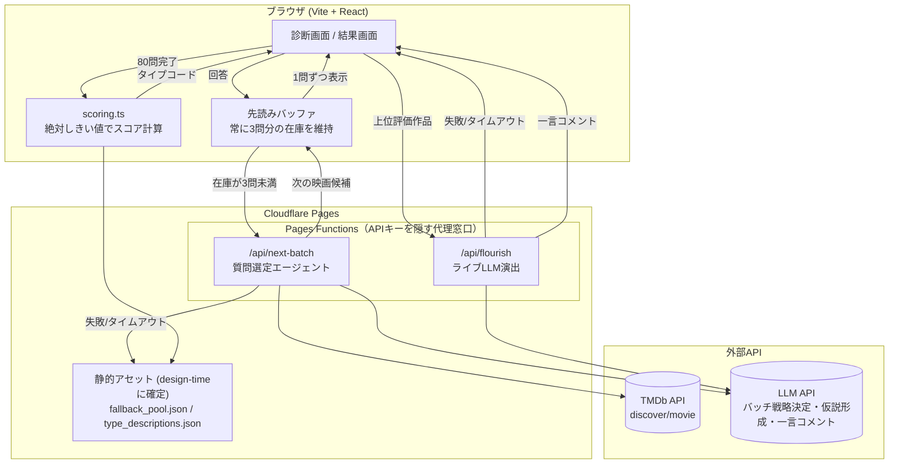
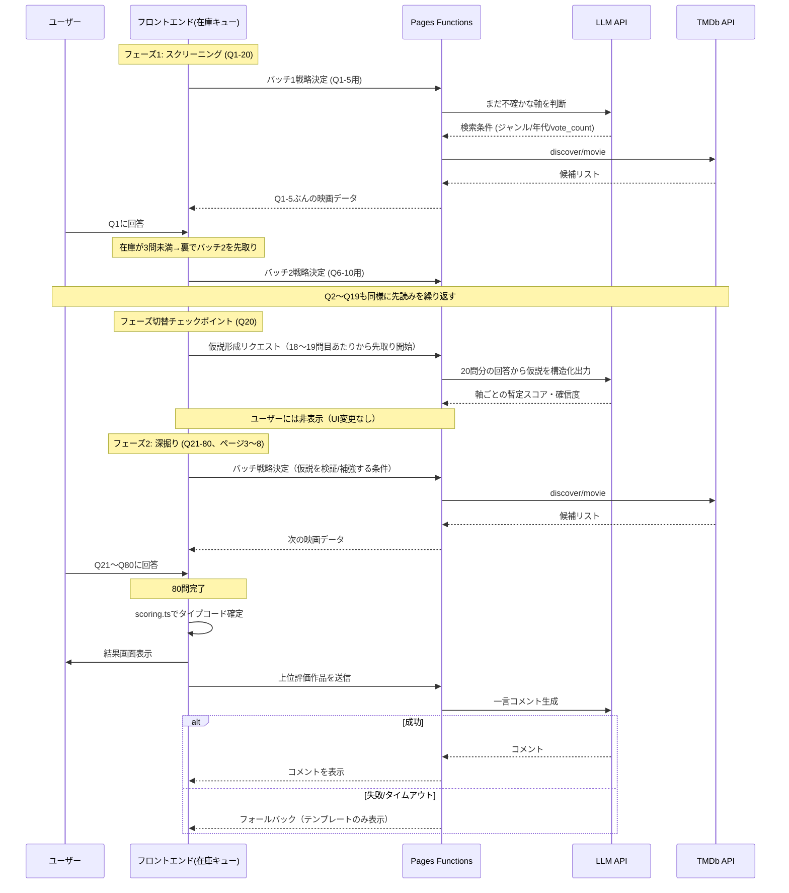

# MovieTI — 映画鑑賞者版タイプ診断

最終更新: 2026-07-14（grillingセッションの決定を反映して全面改訂）
対象イベント: AI4SE Hackathon（2026-07-17, PT 9:00-17:00, ハイブリッド）

用語の正式な定義は [`CONTEXT.md`](./CONTEXT.md) を参照。主要な設計判断の背景と理由は
[`docs/adr/`](./docs/adr/) の各ADRを参照。このドキュメントは両者を踏まえた実装向けの全体仕様。

**アプリの言語は英語。** UI文言・ライブLLM演出の生成文・タイプ見出し名・説明文など、
ユーザーに見える一切は英語にする。本ドキュメント自体（計画書）は日本語のまま。

## 0. 背景・ハッカソンとの関連づけ

AI4SEのテーマは「科学・工学における生成AI（Agentic AI）活用」。審査基準は
「プロジェクトの実現可能性」「テーマとの関連性」「当日の有意義な進捗の達成準備状況」。

MovieTIはユーザー向けには「映画版MBTI」だが、エンジニアリング面では以下を実演する。

> 少数（80問）の疎な行動データ（鑑賞済み/未鑑賞＋評価）から鑑賞者のタイプを推定するにあたり、
> 固定のアンケートではなく、**TMDbの全カタログを道具として使うLLMエージェントが、
> 回答履歴から「まだ判別できていない軸」を都度判断し、次に聞くべき映画をライブで選び続ける**
> （[`docs/adr/0001`](./docs/adr/0001-live-agent-question-selection.md)）。

固定プリセットを廃したことで、質問の並び自体が本番中に生成AIが動き続ける様子として
可視化される。これに加えて、絶対基準によるスコアリング（`docs/adr/0002`）という、
データに基づいた検証可能なアルゴリズム設計というエンジニアリングの物語として発表する。

## 1. プロダクト概要

- 名称: MovieTI
- 一言: TMDbの映画について「見た/見てない」＋評価をテンポよく80問（10問×8ページ）答えると、
  4軸×16タイプの「映画鑑賞者タイプ」が診断されるWebアプリ。質問はエージェントが
  ライブでTMDbから選び続けるため、同じ回答内容でも聞かれる映画は毎回変わりうる。
- ターゲット: 映画好き、MBTI診断が好きな層。ハッカソン当日のデモ観客。
- **スコープ境界（MVP）**: 診断結果を画面に表示するところまで。共有ボタン・画像書き出し・
  SNS連携・アカウント機能・他ユーザーとの比較（レア度%など）は作らない。
  「シェアしたくなる診断」という要望は、共有機能ではなく診断結果の文章の品質基準として扱う。

## 2. タイプ体系（4軸×16タイプ）

MBTIと同じ4軸2極構造。各軸は独立に計算され、**絶対基準**（`docs/adr/0002`）で判定する
（セッションごとに提示される映画が異なるため、ユーザー間で比較可能な固定しきい値を使う）。

| 軸 | 極1 | 極2 | 何を見るか |
|---|---|---|---|
| 鑑賞量 | H = Heavy（多鑑賞） | L = Light（厳選） | 提示された質問数に対する「見た」回答の割合 |
| 時代志向 | N = New（新作志向） | O = Old（旧作・名画志向） | 「見た」かつ高評価の映画の公開年（固定アンカー年基準） |
| 大衆性 | M = Mainstream（大衆派） | U = Underground（ニッチ派） | メジャー作品群/マイナー作品群（TMDbのvote_count絶対しきい値で分類）への評価の高低比較 |
| ジャンル幅 | W = Wide（雑食） | F = Focused（一途） | 高評価作品のうち上位1〜2ジャンルが占める割合（固定カットオフ、鑑賞量と相関しないよう比率で計算） |

タイプコード例: `HNMW` = 大量鑑賞・新作志向・大衆派・雑食

### 見出し名（`docs/adr/0003`）

- **タイプの見出し名**: 固有名詞ではなく、MBTIの「Advocate」「Debater」のような
  説明不要の**英語**アーキタイプ名にする。16個の名称は未着手（9節の未決事項）。
- 監督マッチング機能は2026-07-14に撤回（スコープ過大のため、`docs/adr/0003`）。

### エッジケース

- 「見た」を選んだ場合、星評価は必須（スキップなし）。全軸を常にフルデータで計算する。
- 「見た」が閾値未満の場合、鑑賞量軸以外は信号不足になりうる。閾値未満なら残り3軸は
  ニュートラル（固定デフォルト値）にフォールバックし、結果画面に
  「回答数が少ないため参考値です」を出す。

## 3. データソース

### TMDb API（ランタイム・ライブ）

- `GET /discover/movie` — 質問選定エージェントが都度叩く。ガードレール:
  `vote_count.gte=500` 目安（メタデータの信頼性・国際的な認知度を担保）、
  `include_adult=false`、**`language=en-US`**（タイトル・概要を英語で取得。アプリの言語が
  英語のため）。取得後、`poster_path` が null のものはクライアント側で二重に弾く。
  作品自体の製作国・原語は意図的には絞らない（vote_countのしきい値で自然と国際的に
  認知された作品に寄る）。あくまで表示言語を英語にするだけで、候補となる映画の範囲は
  絞らない。
- `GET /genre/movie/list` — ジャンルID⇔名前のマッピング。
- ポスター画像: `https://image.tmdb.org/t/p/w342/{poster_path}`

### TMDb API（design-time・静的に焼き込み）

以下はビルド時に一度だけ取得し、リポジトリに同梱する。ランタイムでは再取得しない。

- `fallback_pool.json` — [[フォールバックプール]]。TMDb/LLM呼び出し失敗時のみに使う
  少数（10〜20本）の映画キャッシュ。49本まで拡充済み（9節）。
- `type_descriptions.json` — 16タイプの見出し名・説明文。全16タイプ執筆済み（2026-07-15）。

### LLM API（ランタイム）

- 質問選定エージェントのバッチ戦略決定（5問おき）
- 結果画面のライブLLM演出（ユーザーの上位評価作品から一言コメント生成）

いずれもAPIキーをクライアントに直接持たせず、Cloudflare Pages Functions経由で呼ぶ（5節）。

## 4. AIエージェント活用フェーズ

### 4.1 Design-time（事前準備、ハッカソン前）

1. **絶対しきい値の設計**: TMDb実データの分布を見ながら、各軸の絶対基準
   （`vote_count`のメジャー/マイナー境界、公開年の新旧アンカー、ジャンル多様性のカットオフ、
   鑑賞量の%しきい値）をエージェントに提案させ、人手で確認・調整する（`docs/adr/0002`）。
2. **スコアリング重みの合成データ検証**: 「ブロックバスターだけ甘口高評価する人」
   「旧作しか見ないシネフィル」など極端なペルソナの回答パターンを合成し、スコアリング関数が
   想定通りの象限に落ちるか検証。ズレていれば重みを調整、再検証。このループをスクリプト化し、
   イテレーションの様子を発表資料のログとして残す。
3. **フォールバックプールの選定**: 障害時専用の10〜20本を確定（詳細未着手、9節）。
4. **16タイプの命名・説明文**: AIに複数パターン生成させ、一般論にならない具体的な言い回しを
   人手で選ぶ（`docs/adr/0003`）。

design-timeの成果物（`fallback_pool.json`, `type_descriptions.json`,
絶対しきい値の定数, 検証ログ）がそのままアプリの静的アセット・設定値になる。

### 4.2 Runtime（診断中・本番）

1. **質問選定エージェント**（[[質問選定エージェント]]、`docs/adr/0001`）: 固定プリセットを
   持たない。80問固定（早期終了なし、10問×8ページ）で、2フェーズ構造にする。
   - **前半20問（スクリーニング、ページ1〜2）**: 4軸それぞれの両極端をまんべんなく聞き、
     暫定スコアをつける。この絶対数は50問時代から変えていない（後半を厚くするために
     前半を薄くすると、仮説の確信度が下がり後半の深掘りの精度も下がるため）。
   - **20問目のチェックポイント**: LLMが暫定的な「仮説」（どの軸がどちらに寄っていそうか）を
     裏側で言語化する。**ユーザーには見せない**（UI・演出の追加はしない）。
   - **後半60問（深掘り、ページ3〜8）**: 仮説を検証・補強する映画を狙って選ぶ。確信度が
     十分な軸は、タイプ判別ではなくパーソナライズを濃くする方向（シグネチャー映画になりやすい
     作品を狙う）に振り替える。50問→80問の増分（30問）はすべてここに割り当てた。
   - 各フェーズ内はさらに5問ごとにバッチ処理し、TMDb `discover` の検索条件をまとめて決定、
     結果セットから連続して出す（往復回数を抑えるため）。プロンプトは
     [`prompts/question-agent.md`](./prompts/question-agent.md)。
   - TMDb/LLM呼び出しが失敗/タイムアウトした場合のみフォールバックプールに切り替える。
2. **仮説形成エージェント**: 20問目のチェックポイントで、20問分の回答から軸ごとの暫定
   スコア・確信度を構造化データで出力する。ユーザーには見せない裏方。プロンプトは
   [`prompts/hypothesis-agent.md`](./prompts/hypothesis-agent.md)。
3. **ライブLLM演出（結果生成エージェント）**（[[ライブLLM演出]]）: 結果画面で、ユーザーの
   上位評価作品からLLMが即席で一言コメントを生成する。失敗/タイムアウト時はパーソナライズ層の
   テンプレートのみの表示に自動フォールバックする。3つのエージェントの中で唯一
   ユーザーに文章が見える役割なので、ここにだけ「シネマセラピスト」のキャラクター性を持たせる
   （4.3節）。プロンプトは [`prompts/result-writer.md`](./prompts/result-writer.md)。
   モデル・タイムアウト値は未確定（9節）。

### 4.3 エージェントの役割分担とプロンプトファイル

3つのエージェントは役割がはっきり分かれる。①②は裏方でJSON等の構造化出力のみ、
③だけがユーザーに読まれる文章を書く。

| ファイル | 役割 | 出力 | ユーザーに見えるか | キャラクター性 |
|---|---|---|---|---|
| `prompts/question-agent.md` | 質問選定バッチ戦略 | TMDb `discover` 検索条件（JSON） | 見えない | なし（機能的） |
| `prompts/hypothesis-agent.md` | 20問目の仮説形成 | 軸ごとの暫定スコア・確信度（JSON） | 見えない | なし（機能的） |
| `prompts/result-writer.md` | 結果画面の一言コメント | 英語の短文 | **見える** | シネマセラピスト（占い師×心理学者、キレのいい言葉） |

裏方の①②にあえて個性を持たせない理由: 個性的な言い回しを混ぜると、JSONの前後に
余計な前置き・雑談が混ざり出力が壊れるリスクが上がる。ユーザーに見える文章を書く役割（③）に
キャラクター性を集中させる。

**LLMの判断とAPI呼び出しは別レイヤー**であることに注意。LLM（①）は「どんな検索条件が
良いか」を考えてJSONというテキストを返すだけで、LLM自身がTMDbに直接アクセスすることはない。
実際にTMDbへHTTPリクエストを送るのは、Pages Functions内の通常のサーバーコード
（AIではない）で、LLMが返したJSONを受け取って検証し、そのパラメータでTMDbの
discoverエンドポイントを呼び出す。詳細なリクエスト/レスポンスの流れは5.2節のシーケンス図を参照。

## 5. アーキテクチャ

- フロントエンド: Vite + React（Cloudflare Pagesにデプロイ）
- **バックエンド（薄いプロキシ）**: Cloudflare Pages Functions。TMDb・LLMのAPIキーを
  クライアントに露出させないための代理窓口。最低限これだけの役割で、状態の永続化は行わない
  （ユーザーアカウントやDBは持たない）。
- 状態管理: フロントはReactのuseStateで80件の回答配列を保持するだけ
- プロンプト: `prompts/question-agent.md` / `prompts/hypothesis-agent.md` / `prompts/result-writer.md`
  （4.3節）。Pages Functionsからテキストファイルとして読み込み、変数を埋め込んでLLM APIに渡す。
- HTTP API契約: `src/api-types.ts`に型を確定（`/design-an-interface`で4案を比較して統合）。
  エンドポイントは`/api/next-batch`と`/api/flourish`の2つのみ。20問目の仮説形成
  チェックポイントは独立エンドポイントにせず、`/api/next-batch`内部で吸収する
  （フロントは常に同じ形のリクエストを送るだけでよい）。詳細はCONTEXT.md「HTTP APIの契約」参照。
- 静的アセット: `data/fallback_pool.json`, `data/type_descriptions.json`
  （いずれもdesign-timeに確定、ランタイムでは読み取り専用）。スキーマは
  `src/lib/typeDescriptions.ts` / `functions/api/_lib/fallback-pool.ts`に確定
  （`/design-an-interface`で3案比較、詳細はCONTEXT.md参照）。中身（16タイプの文面・
  フォールバック映画の選定）はcontent-designフェーズの別タスク（9節）。
- 先読みバッファ: `src/hooks/useMovieBuffer.ts`の`useMovieBuffer`フックに確定
  （`/design-an-interface`で3案比較、詳細はCONTEXT.md「先読みバッファ」参照）。
- LLM呼び出しの共通処理: `functions/api/_lib/llm-task.ts`（共有プリミティブ`runLlmTask`）と
  `functions/api/_lib/agents.ts`（呼び出し箇所ごとの3関数）に確定
  （`/design-an-interface`で3案比較、詳細はCONTEXT.md参照）。
- スコアリング: クライアントサイドの純粋関数（`src/scoring.ts`）。絶対しきい値を使うため
  外部呼び出し不要。**80問完了時の最終計算だけでなく、回答が集まるたびに毎回実行し、
  その時点までの回答だけで暫定の`axis_scores`（スコア・確信度）を計算する用途にも使う。**
  この暫定値をAPIリクエストのボディに含めてサーバー/LLMに渡す。軸のスコア・確信度の数値は
  常にこの関数（決定的な計算）が算出し、LLMが数値を計算し直すことはない
  （`prompts/hypothesis-agent.md`も参照）。
- 状態の永続化: サーバー側はステートレス（Cloudflare Pages Functionsはリクエスト間で何も
  記憶しない）。回答履歴の唯一の保持場所はブラウザのReact state。サーバーが必要とする
  情報は、その都度リクエストのボディに含めて送る。誤リロード対策として、Reactの状態が
  更新されるたびに `localStorage` にも書き込み、ページ再読み込み時に復元する
  （新規インフラ不要、ブラウザ標準機能のみ）。
- グラフ: 結果画面の4軸レーダーチャートに軽量ライブラリ（recharts等）
- ビジュアルデザイン: ダークモード基調、オレンジ〜レッドのグラデーション配色（紫は使わない、
  `docs/adr/0004`）。`src/index.css`のCSS変数（`--accent`, `--accent-2`, `--accent-gradient`
  等）に確定済み。今後追加するUIコンポーネントもこのトークンに従う。
- リポジトリ: 公開GitHubリポジトリ必須（ハッカソン提出要件）

### 5.1 システム構成図



### 5.2 ランタイムのシーケンス（2フェーズ＋先読み）



## 6. ユーザーフロー

1. トップ画面: サービス説明＋「はじめる」ボタン
2. 診断画面: 全80問、10問ずつ8ページに区切って1問ずつポスター＋タイトル＋年を表示。
   ページ1〜2がスクリーニング、ページ3〜8が深掘り（4.2節）。
   - ボタン「Haven't seen it」→ 即次へ
   - ボタン「Seen it」→ 星評価(1-5、必須)→ 次へ
   - （UI文言は英語。上記は内容説明のための日本語併記）
   - 進捗バー（n/80）。裏側で[[先読みバッファ]]が常に3問分の在庫を維持し、エージェントの
     バッチ戦略決定はユーザーの回答ペースより先回りして進むため、通常はローディングを
     見せない（在庫切れ時のみ例外的に短いローディングを見せる）
3. 計算: 80問完了で `scoring.ts` が4軸スコア・タイプコードを算出
4. 結果画面: タイプ見出し名・説明文・レーダーチャート・ライブLLMの一言コメント
   （失敗時はテンプレートのみ）

## 7. スコアリング擬似コード

```
# 絶対しきい値は事前に確定した定数（docs/adr/0002）
for each answer in 80 answers:
  if not seen: continue  # 鑑賞量以外には寄与しない
  volumeSeenCount += 1
  isMajor = movie.vote_count >= MAJOR_VOTE_COUNT_THRESHOLD   # 絶対しきい値
  ratingBucket[isMajor ? 'major' : 'minor'].push(userRating_normalized)

  if userRating < HIGH_RATING_THRESHOLD: continue  # 時代・幅は「見た」だけでなく
                                                    # 「高評価だった」ものだけが寄与する
                                                    # （CONTEXT.md「軸 (Axis)」参照）
  eraScore += eraWeight(movie.year, ERA_ANCHOR_YEAR)         # 絶対アンカー基準
  genreSeen.add(movie.genres)

axis.鑑賞量 = (volumeSeenCount / totalQuestions) > VOLUME_RATIO_THRESHOLD ? 'H' : 'L'
axis.時代   = eraScore > 0 ? 'N' : 'O'
axis.大衆性 = avg(ratingBucket.major) > avg(ratingBucket.minor) ? 'M' : 'U'
topGenreShare = sum(highestNGenreCounts(genreSeen, n=2)) / totalGenreTagCount  # ジャンルタグの
                                                          # 総出現数が分母（映画本数ではない。
                                                          # 1本が複数ジャンルを持つため）
axis.幅     = topGenreShare > GENRE_CONCENTRATION_THRESHOLD ? 'F' : 'W'

typeCode = axis.鑑賞量 + axis.時代 + axis.大衆性 + axis.幅   # 例: "HNMW"
```

（`scoring.ts`の実際の出力は各軸を`{score: -1..1, confidence: 0..1}`で持つ。上記はH/L等の
文字がどちらに転ぶかの判定ロジックの説明であり、実装はスコア・確信度を経由する。5節参照。）

## 8. スケジュール（ソロ開発、3日＋当日）

- **7/14（今日）**: grillingセッションでの決定を反映し本ドキュメント改訂（完了）。
  TMDb APIキー・LLM APIキー取得。Vite+React雛形作成。Cloudflare Pages/Wranglerのセットアップ。
- **7/15**: design-timeのAIエージェント作業一式（4.1節）: 絶対しきい値の設計、
  合成データ検証ループ、フォールバックプール確定。`fallback_pool.json` 確定。
- **7/16**: Pages Functions（TMDb/LLMプロキシ）実装。質問選定エージェント（バッチ戦略決定
  ロジック）実装。診断画面・scoring.ts実装。16タイプ名・説明文のコピーライティング。
- **7/17（当日）**: 結果画面の磨き込み（レーダーチャート、ライブLLM演出）、
  発表資料作成、デモリハーサル（エージェントの挙動を複数回実行して目視確認）。
  あえて当日にやる作業を残しておく（審査基準「当日の進捗」対応）。

## 9. 未決事項

- [x] 16タイプの正式名称・コピー・説明文（MBTI式のアーキタイプ名、`docs/adr/0003`、
      `data/type_descriptions.json`に全16タイプ執筆済み、2026-07-15）
- [x] フォールバックプール: `data/fallback_pool.json`に49本を選定済み（2026-07-15）。
      ジャンル・原語（英語以外も12言語）・監督（1監督1本を基本方針、ユーザーとの
      対話で作品ごとにレビューして調整）で分散させた。今後さらに追加・調整の余地は
      あるが、初期選定としては完了
- [x] ライブLLM演出のモデル選定・タイムアウト値・プロンプト内容（3エージェントとも
      Workers AI、`functions/api/_lib/agents.ts`、ADR 0005）。プロンプトは実データで
      複数回チューニング済み（`prompts/result-writer.md`、2026-07-15）だが、
      さらなる改善の余地は残っている
- [ ] TMDbガードレール（`vote_count.gte`など）とscoring.tsの絶対しきい値
      （`SCORING_CONSTANTS`、`src/scoring.ts`）は初期見積もり値のまま。実データで
      検証・調整できていない — 残っている最大の未決事項
- [x] 質問選定エージェント／仮説形成／結果生成の各プロンプトの初稿（`prompts/`、4.3節）。
      実データで試しながらのチューニングは未着手。
- [x] `/api/next-batch`・`/api/flourish`のHTTP API契約（`src/api-types.ts`、5節参照）
- [x] 先読みバッファ／LLM呼び出し共通処理／`type_descriptions.json`・`fallback_pool.json`の
      インターフェース設計（`/design-an-interface`、5節・CONTEXT.md参照）。
      `src/hooks/useMovieBuffer.ts`は実装済み、他2つは型・関数シグネチャの決定のみで実装は未着手。
